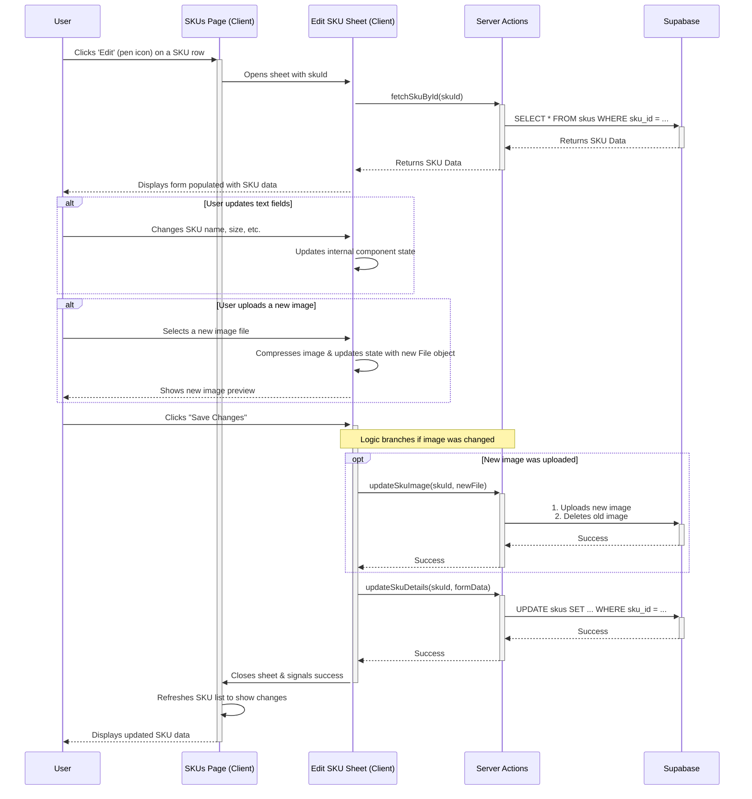

# 29-SKU Edit Page Setup

This document outlines the setup and implementation details for the SKU editing feature.

## Overview

The SKU edit page will allow users to modify existing SKU details, including their attributes and associated images. This feature leverages existing server actions for data persistence and image management.


# Overall Objective

To empower users to modify existing SKUs, including their images and other attributes, by activating the "pen" icon on the main SKUs page. This will be achieved by creating a new `EditSKUSheet` component that leverages existing server actions and follows the established architectural patterns of the application.

## Feature Flow Diagram



---

## Detailed Step-by-Step Plan with Code

### Step 1: Create the Backend Foundation

#### Substep 1.1: Create `fetchSkuById` API Function
- **Objective**: To create a function that can retrieve a single, specific SKU from the database for the edit form.
- **File to Change**: `lib/api-service.ts`
- **Risk Level**: Very Low
- **Assumptions**:
  - The pattern for fetching data from Supabase is consistent and reusable. (Status: Validated)
  - The database schema for skus is known. (Status: Validated)
- **Code Snippet**:

```typescript
// Add this new function to lib/api-service.ts
export async function fetchSkuById(skuId: string): Promise<SKU | null> {
  const startTime = performance.now();
  logger.info(`fetchSkuById called`, { data: { skuId } });

  try {
    const { data, error } = await supabase
      .from("skus")
      .select("*")
      .eq("sku_id", skuId)
      .single();

    if (error) {
      logger.error(`Error fetching SKU from Supabase`, { data: { skuId }, error });
      return null;
    }

    if (!data) return null;

    const sku: SKU = {
      id: data.sku_id,
      name: data.name,
      category: data.category,
      collection: data.collection,
      size: data.size !== null ? Number(data.size) : undefined,
      goldType: data.gold_type,
      stoneType: data.stone_type,
      diamondType: data.diamond_type,
      weight: data.weight,
      image: data.image_url,
      createdAt: data.created_at,
    };
    return sku;
  } catch (error) {
    logger.error(`Unexpected error in fetchSkuById`, { data: { skuId }, error });
    return null;
  }
}
```

#### Substep 1.2: Create `updateSkuDetails` Server Action
- **Objective**: To create a server action that updates the non-image fields of a SKU.
- **File to Change**: `app/actions/sku-actions.ts`
- **Risk Level**: Low
- **Assumptions**:
  - The pattern for creating a service client and calling `.update()` is established. (Status: Validated)
- **Code Snippet**:

```typescript
// Add this new function to app/actions/sku-actions.ts
export async function updateSkuDetails(skuId: string, skuData: Partial<SKU>) {
  const startTime = performance.now();
  logger.info(`updateSkuDetails called`, { data: { skuId, skuData } });
  const supabase = createServiceClient();

  const supabaseSkuData = {
    name: skuData.name,
    category: skuData.category,
    collection: skuData.collection,
    size: skuData.size,
    gold_type: skuData.goldType,
    stone_type: skuData.stoneType,
    diamond_type: skuData.diamondType,
    weight: skuData.weight,
    updated_at: new Date().toISOString(),
  };

  try {
    const { error } = await supabase.from("skus").update(supabaseSkuData).eq("sku_id", skuId);
    if (error) throw error;

    revalidatePath("/skus");
    revalidatePath(`/skus/${skuId}`);
    return { success: true };
  } catch (error) {
    logger.error(`Error in updateSkuDetails`, { data: { skuId }, error });
    return { success: false, error: "Failed to update SKU details." };
  }
}
```

---

### Step 2: Build the `EditSKUSheet` Frontend Component

#### Substep 2.1: Create the Component Shell
- **Objective**: To create the basic file and boilerplate structure for the new `EditSKUSheet` component.
- **File to Change**: `components/edit-sku-sheet.tsx` (New File)
- **Risk Level**: Very Low
- **Assumptions**:
  - The existing `NewSKUSheet` is a suitable template. (Status: Validated)
- **Code Snippet**:

```typescript
// Create the new file components/edit-sku-sheet.tsx
"use client";
import { useState, useEffect } from "react";
import { Button } from "@/components/ui/button";
import { Input } from "@/components/ui/input";
import { Select, SelectContent, SelectItem, SelectTrigger, SelectValue } from "@/components/ui/select";
import { Sheet, SheetContent, SheetDescription, SheetHeader, SheetTitle, SheetFooter } from "@/components/ui/sheet";
import { Alert, AlertDescription } from "@/components/ui/alert";
import { Loader2 } from "lucide-react";
import { ImageUpload } from "@/components/image-upload";
import { SKU } from "@/types";
import { fetchSkuById } from "@/lib/api-service";
import { updateSkuDetails } from "@/app/actions/sku-actions";
import { updateSkuImage } from "@/app/actions/image-actions";
import { SKU_CATEGORY, COLLECTION_NAME, GOLD_TYPE, STONE_TYPE } from "@/constants/categories";

interface EditSKUSheetProps {
  skuId: string | null;
  open: boolean;
  onOpenChange: (open: boolean) => void;
  onSkuUpdated: () => void;
}

export function EditSKUSheet({ skuId, open, onOpenChange, onSkuUpdated }: EditSKUSheetProps) {
  // State and logic will be added in the next steps
  return (
    <Sheet open={open} onOpenChange={onOpenChange}>
      <SheetContent className="w-full sm:max-w-xl md:w-[calc(100vw-240px)] overflow-y-auto force-full-width-sheet">
        <SheetHeader>
          <SheetTitle>Edit SKU</SheetTitle>
          <SheetDescription>
            Modify the details for SKU: {skuId || '...'}
          </SheetDescription>
        </SheetHeader>
        {/* Form content will be added here */}
        <SheetFooter className="mt-6">
          <Button disabled>Save Changes</Button>
        </SheetFooter>
      </SheetContent>
    </Sheet>
  );
}
```

#### Substep 2.2 & 2.3: Implement Data Fetching, State, and Form Inputs
- **Objective**: To load data for the specific SKU, manage the form's state, and connect the inputs.
- **File to Change**: `components/edit-sku-sheet.tsx`
- **Risk Level**: Low
- **Assumptions**:
  - `fetchSkuById` will work as planned. (Status: Unvalidated, but low risk.)
- **Code Snippet**:

```typescript
// Replace the body of the EditSKUSheet component with this:
const [sku, setSku] = useState<SKU | null>(null);
const [loading, setLoading] = useState(false);
const [error, setError] = useState<string | null>(null);
const [imageFile, setImageFile] = useState<File | null>(null);
const [isSaving, setIsSaving] = useState(false);

useEffect(() => {
  if (open && skuId) {
    const loadSku = async () => {
      setLoading(true);
      setError(null);
      setSku(null);
      setImageFile(null);
      try {
        const fetchedSku = await fetchSkuById(skuId);
        if (fetchedSku) setSku(fetchedSku);
        else setError("Failed to fetch SKU details.");
      } catch (err) { setError("An unexpected error occurred."); }
      finally { setLoading(false); }
    };
    loadSku();
  }
}, [open, skuId]);

const handleInputChange = (field: keyof SKU, value: any) => {
  if (sku) setSku({ ...sku, [field]: value });
};

const handleImageChange = (file: File | null) => {
  setImageFile(file);
  if (file && sku) setSku({ ...sku, image: URL.createObjectURL(file) });
};

// ... inside the return statement, replace the SheetContent children
<div className="py-4 space-y-4">
  {loading && <div className="flex justify-center"><Loader2 className="animate-spin" /></div>}
  {error && <Alert variant="destructive"><AlertDescription>{error}</AlertDescription></Alert>}
  {sku && (
    <>
      <div><label>SKU Name</label><Input value={sku.name} onChange={(e) => handleInputChange('name', e.target.value)} /></div>
      <div><label>Category</label>
        <Select value={sku.category} onValueChange={(value) => handleInputChange('category', value)}>
          <SelectTrigger><SelectValue /></SelectTrigger>
          <SelectContent>{Object.values(SKU_CATEGORY).map(cat => <SelectItem key={cat} value={cat}>{cat}</SelectItem>)}</SelectContent>
        </Select>
      </div>
      {/* Add other inputs for collection, goldType, size, etc. following this pattern */}
      <div><label>Image</label><ImageUpload value={sku.image} onChange={handleImageChange} /></div>
    </>
  )}
</div>
```

#### Substep 2.4: Implement the Save Logic
- **Objective**: To connect the "Save" button to the backend server actions.
- **File to Change**: `components/edit-sku-sheet.tsx`
- **Risk Level**: Medium
- **Assumptions**:
  - `updateSkuImage` and the new `updateSkuDetails` will work as planned. (Status: Unvalidated)
- **Code Snippet**:

```typescript
// Add this function inside the EditSKUSheet component
const handleSave = async () => {
  if (!sku || !skuId) return;
  setIsSaving(true);
  setError(null);
  try {
    if (imageFile) {
      const imageResult = await updateSkuImage(skuId, imageFile);
      if (!imageResult.success) throw new Error(imageResult.error || "Failed to update image.");
    }
    const detailsResult = await updateSkuDetails(skuId, sku);
    if (!detailsResult.success) throw new Error(detailsResult.error || "Failed to update SKU details.");
    onSkuUpdated();
    onOpenChange(false);
  } catch (err) {
    setError(err instanceof Error ? err.message : "An unknown error occurred.");
  } finally {
    setIsSaving(false);
  }
};

// Update the SheetFooter button
<SheetFooter className="mt-6">
  <Button onClick={handleSave} disabled={isSaving || loading}>
    {isSaving && <Loader2 className="mr-2 h-4 w-4 animate-spin" />}
    Save Changes
  </Button>
</SheetFooter>
```

---

### Step 3: Activate the Edit Feature in the UI

- **Objective**: To enable the "pen" icon on the SKUs table to open the new sheet.
- **File to Change**: `app/skus/page.tsx`
- **Risk Level**: Very Low
- **Assumptions**:
  - The pattern for managing sheet state can be replicated. (Status: Validated)
- **Code Snippet**:

```typescript
// In app/skus/page.tsx

// 1. Add necessary import and state
import { EditSKUSheet } from "@/components/edit-sku-sheet";
// ... inside SKUsPage component
const [editSheetOpen, setEditSheetOpen] = useState(false);
const [selectedSkuId, setSelectedSkuId] = useState<string | null>(null);

const handleEditClick = (skuId: string) => {
  setSelectedSkuId(skuId);
  setEditSheetOpen(true);
};

const handleSkuUpdated = () => {
  handleRefresh(); // Re-use existing refresh logic
};

// 2. Update the "Actions" column render function
render: (sku) => (
  <div className="flex justify-end gap-2">
    <Button variant="ghost" size="icon" onClick={() => handleEditClick(sku.id)}>
      <Edit className="h-4 w-4" />
      <span className="sr-only">Edit</span>
    </Button>
    <Button variant="ghost" size="icon" onClick={() => handleDeleteSKU(sku.id)} disabled={actionInProgress}>
      <Trash2 className="h-4 w-4" />
      <span className="sr-only">Delete</span>
    </Button>
  </div>
),

// 3. Add the new sheet component to the JSX, inside the main div
<EditSKUSheet
  skuId={selectedSkuId}
  open={editSheetOpen}
  onOpenChange={setEditSheetOpen}
  onSkuUpdated={handleSkuUpdated}
/>
```
```